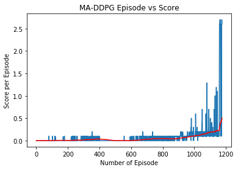
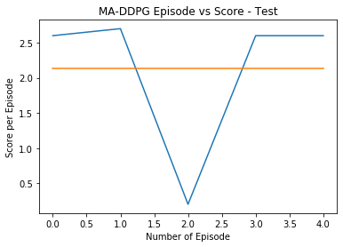

# Deep Reinforcement Learning Nanodegree

## Collaboration and Competition - Train an RL agent to play tennis

Environment consist of two agents control rackets to bounce a ball over a net. If an agent **hits the ball over the net**, it receives a reward of **+0.1**. If an agent lets a **ball hit the ground** or **hits the ball out of bounds**, it receives a reward of **-0.01**. Thus, the goal of each agent is to keep the ball in play.

To solve the environment, agent must achieve an average (over 100 episodes) of those **scores** is at least **+0.5**.


### Evaluate State & Action Space

The observation space consists of 8 variables corresponding to the position and velocity of the ball and racket. Each agent receives its own, local observation. Two **continuous actions** are available, corresponding to **movement** toward (or away from) the net, and **jumping**. 

The task is episodic, and to calculate the reward for each episode we need to take maximum over both agents; Specifically:

- After each episode, we add up the rewards that each agent received (without discounting), to get a score for each agent. 
- This yields 2 (potentially different) scores. We then take the maximum of these 2 scores.
- This yields a single **score** for each episode.

### Getting Started

Download the environment from one of the links below.  You need only select the environment that matches your operating system:

- Linux: [click here](https://s3-us-west-1.amazonaws.com/udacity-drlnd/P3/Tennis/Tennis_Linux.zip)
- Mac OSX: [click here](https://s3-us-west-1.amazonaws.com/udacity-drlnd/P3/Tennis/Tennis.app.zip)
- Windows (64-bit): [click here](https://s3-us-west-1.amazonaws.com/udacity-drlnd/P3/Tennis/Tennis_Windows_x86_64.zip)

Install the [python](https://www.anaconda.com/products/individual) with the required virtual environment to execute the jupyter notebook using `requirement.txt`.

```shell
$ conda create --name RL --file requirement.txt
$ conda activate RL
$ jupyter notebook Tennis.ipynb
```

Follow the instructions in `Tennis.ipynb` to get started with training or execution of the trained agent.

### Algorithm - Multi Agent Deep Deterministic Policy Gradient (MADDPG)

A model-free, off-policy actor-critic algorithm using deep function approximators that can learn policies in high-dimensional, continuous action spaces. Multi Agent adoption of Deep Deterministic Policy Gradient uses seperate actors and critics for each agents and a shared memory buffer in between them.

Implementation of the algorithm can be seen in file `model.py` which contain three major part of Multi Agent Deep Deterministic Policy Gradient as mentioned below:

- Actor-Critic methods - To leverage the strengths of both value-based and policy-based methods.
- Ornstein-Uhlenbeck process - To systematically manage the exploration vs. exploitation trade-off.
- Experience replay - To randomly sample data, so that the it become uncorrelated.

### Implementation Result

Group contain two agents (one corresponding to each agent in the environment) with combination of Actor and Critic network. Actor and Critic networks have simple model with two fully-connected hidden layers of 128 units, which worked well after some trial-and-error of hypyerparametes (hidden layers, buffer size, gamma, learning rate, sigma, and other).

```python
# hyperparametes
BUFFER_SIZE = int(1e5)       # replay buffer size
BATCH_SIZE = 256             # minibatch size
GAMMA = 0.90                 # discount factor
TAU = 1e-3                   # for soft update of target parameters
LR_ACTOR = 1e-3              # learning rate of the actor 
LR_CRITIC = 1e-3             # learning rate of the critic
WEIGHT_DECAY = 1e-6          # L2 weight decay
SIGMA = 0.1                  # volatility parameter
HIDDEN_UNIT = 128            # number of units in hidden layer
```



Agent were able to solve the environment is 1176 steps with and average reward of +0.5 over 100 consecutive episodes. Test result of the agent on fresh environment for 5 episode is shown below.



### Future Improvements

This is start and there is plenty of space for improvement as we can see from the training/test result and few other things which I noticed in unity environment simulation during training of the agent.

- Clearly as we can see that training is not stable from the reward plot; ie mean reward is incressing but not with more stable and consistent score.
- Using priority buffer can also help in the converging the neural network faster with more stable training.
- Training time ie number of episode can be reduced I bet it can be solved around 400-500 episode (as observed) with more optimised network and hypyerparametes tunning.